# Project setup

**There is two ways to Setup the project and build on your computer:**  
1. [Android Studio IDE](project_setup.md#setting-up-the-project-with-android-studio)
2. [Command-line](project_setup.md#setting-up-the-project-with-command-line)

## Setting up the project with Android Studio

>Android Studio is Google's official IDE (integrated development environment) which is based on Jetbrain's IntelliJ IDEA for Android Operating System. 

**There is two ways for Setting up the project with Android Studio:**  
1. [Git clone (recommended)](project_setup.md#git-clone-recommended)
2. [Download source-code as a zip](project_setup.md#downloading-the-zip-from-github)

#### Git clone (recommended)

1. After installing Android studio and setting up SDK, copy repo URL of [template](https://github.com/substratum/template).  

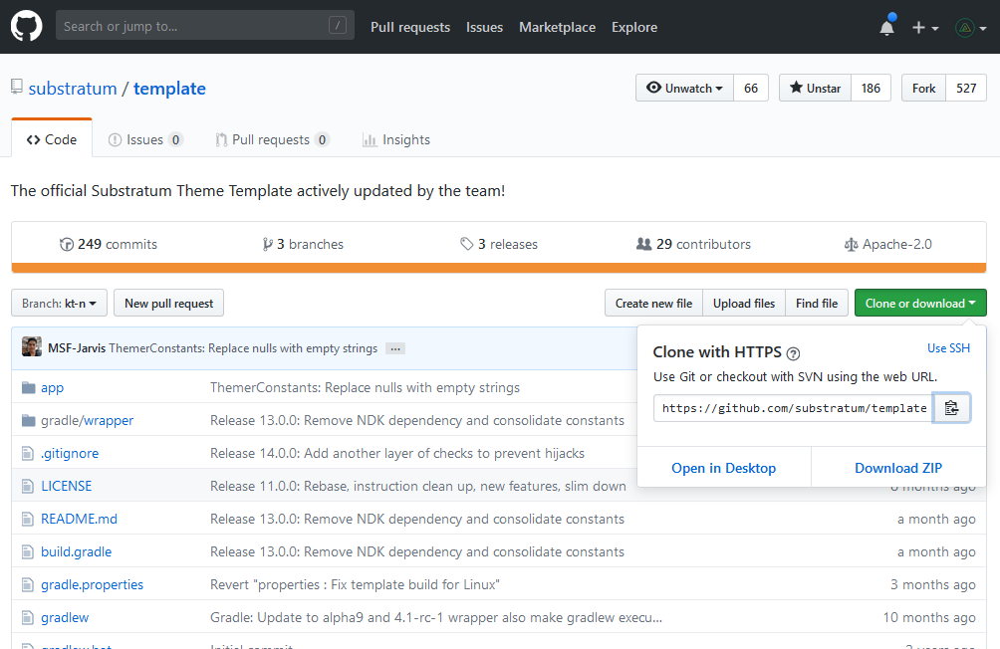

2. Open Android studio and click on `Checkout project from version control` and select the version control service on which your project being hosted on (usually it's `Git`).  

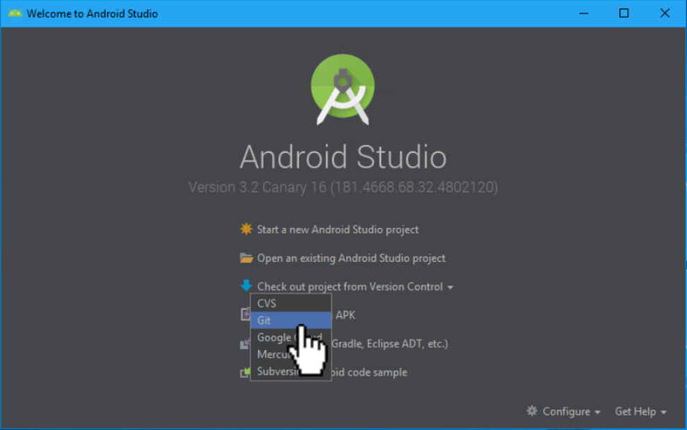

3. Paste the copied repo URL and change directory of clone if necessary and click `Clone`.  

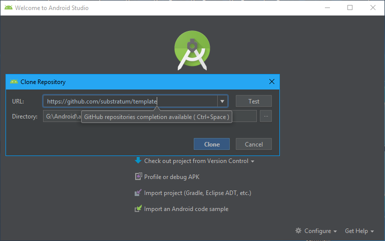

4. Android studio will start cloning the repo.  

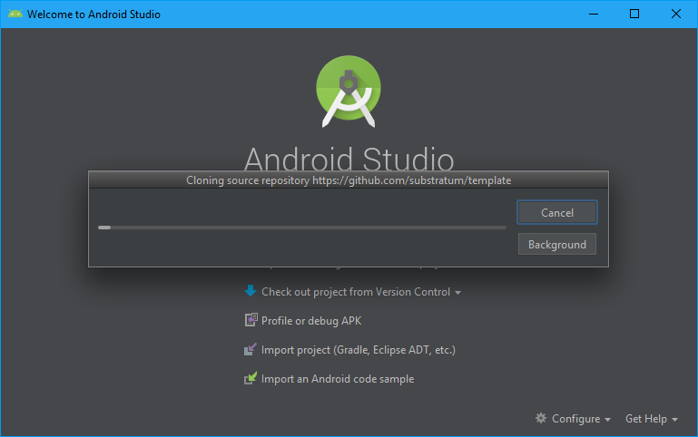

5. Android studio will throw a prompt saying whether you want to create android studio project for the checked out/cloned source. select `Yes`. 

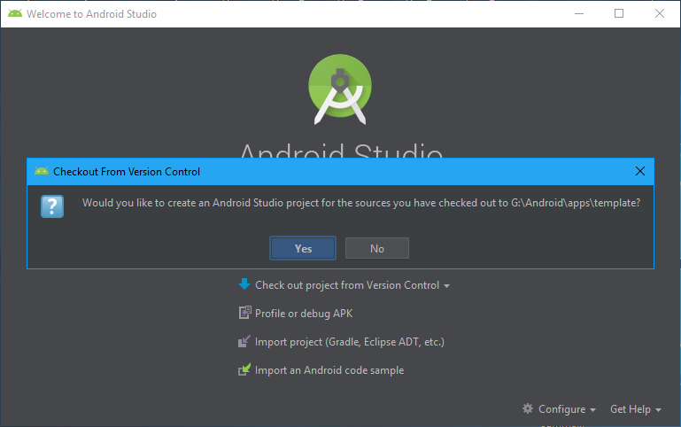

6. Android studio will now show import window. select `Import projects from external model` and click `next`.  

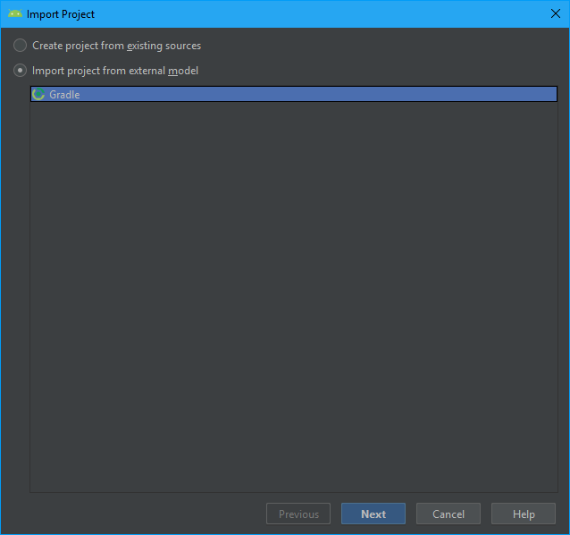

7. Android studio will now open Gradle setup window. click `Next`.  

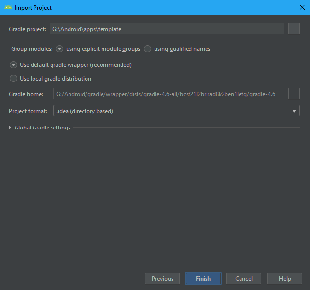

#### Downloading the zip from Github

1. Open [template](https://github.com/substratum/template) repo and click on `Clone or download` and select `Download ZIP`.  

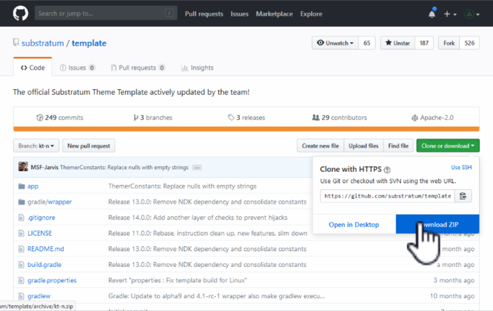

2. Save and extract it.  

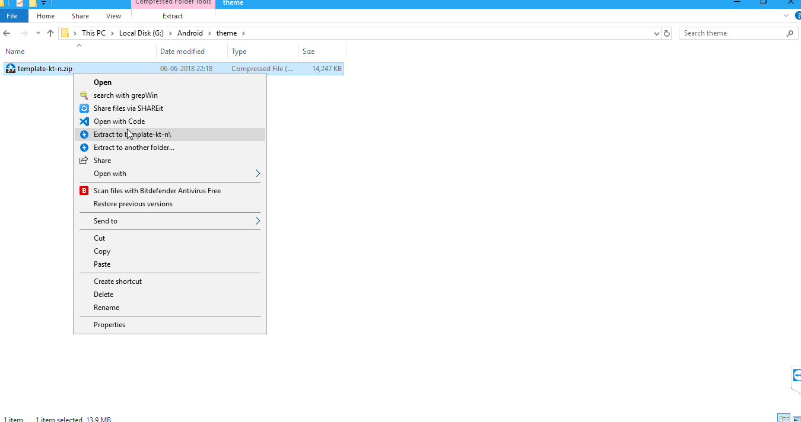

3. Open Android studio and click on `Import project (Gradle, Eclipse, ADT etc.)`.  

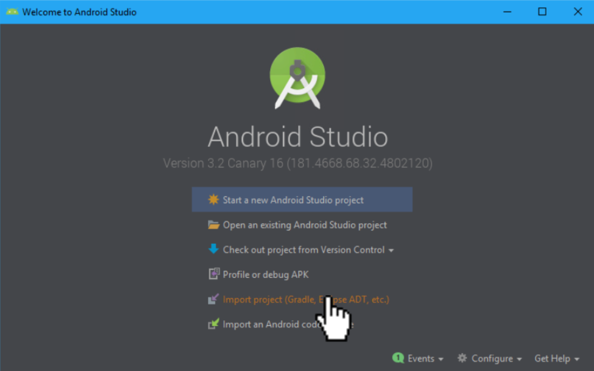

4. Browse to the extracted template directory and press `OK`.  

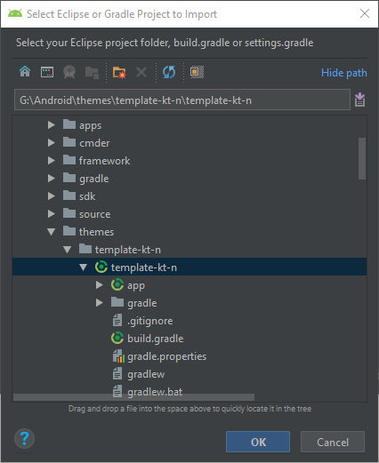

>After importing project; Android studio will try to sync gradle. if the project using outdated gradle distribution. it'll throw a prompt to update gradle version manually. click `Update`. 

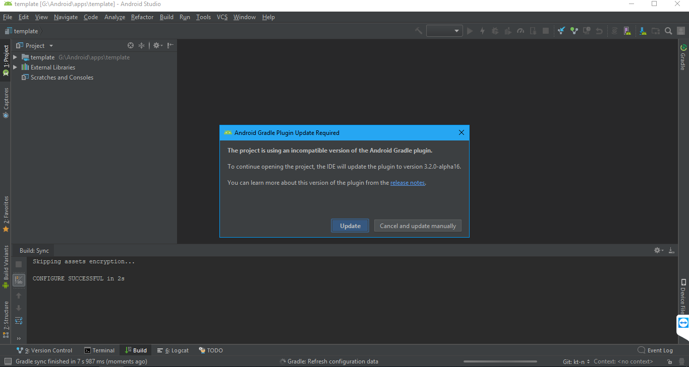

>And the gradle synced successfully!.  

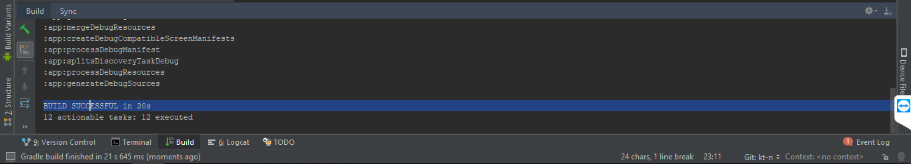

### Setting up "Run" configuration

`Run` is a very handy feature for testing new changes as quickly as possible. `Run` will compile the source and automatically installs to the device which is connected through `ADB`.  

As theme template doesn't comes with any launchable activity; we need to tell `Run` configuration to launch nothing, So it can compile & install silently without launching any activity.  

1. Press `App` button and click on `Edit configuration`.  

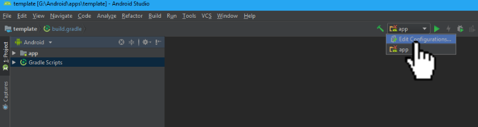

2. Click on `Launch:` and select activity to `Nothing` and press `OK`.  

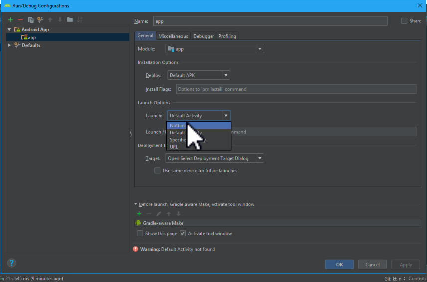

3. Connect phone using USB and press `Run` icon to start compiling and install into the connected device.  

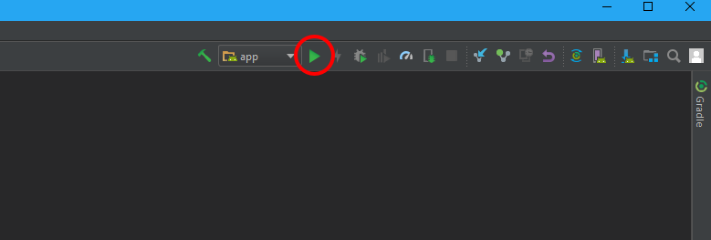

>Android studio will open dialog with a list of devices connected to "ADB". Select the device you want Android studio to install the app after compilation.

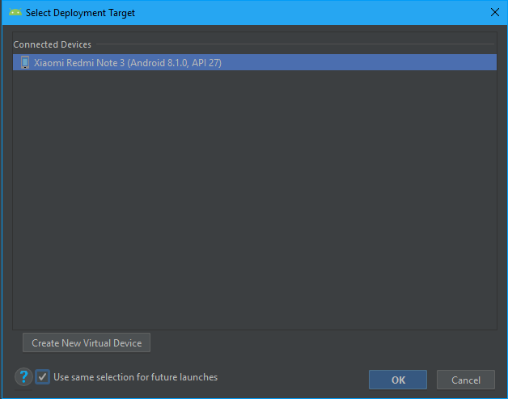

### Disable Instant run

Instant run is a latest feature of Android studio which pushes only updated code and resources to your connected device by performing swap which might cause issues with template as we do changes only on assets/ most of the time. So its recommended to disable Instant run.  

1. Open Android studio Settings.  

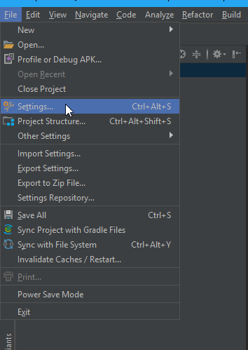

2. Select `Build, Execution, Deployment` and uncheck the `Instant run` option and press `OK`.  

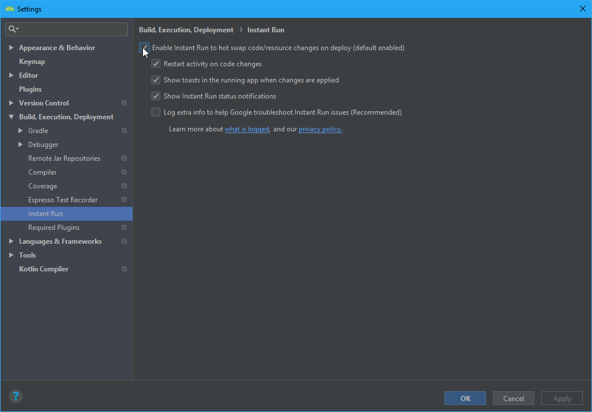

## Setting up the project with command-line

The command-line method is the simple & easiest way compared to [Android studio method](project_setup.md#setting-up-the-project-with-android-studio) and its the recommended option for low-end or old PC's.

Before proceeding further, make sure Android SDK is installed and following environment variables are set:

`JDK_HOME = JDK installed path`  
`JRE_HOME = JRE installed path`  
`ANDROID_HOME = Android SDK installed path`  

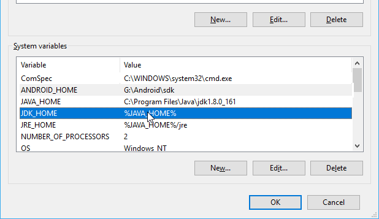

1. Either [clone the template](project_setup.md#git-clone-recommended) or [download the template as a zip](project_setup.md#downloading-the-zip-from-github) and extract it.

3. Open the cloned/extracted directory and hover mouse to empty area and `hold shift + right click` and select `Open PowerShell window here` or if you're on older version of windows, select`Open command line window here`.

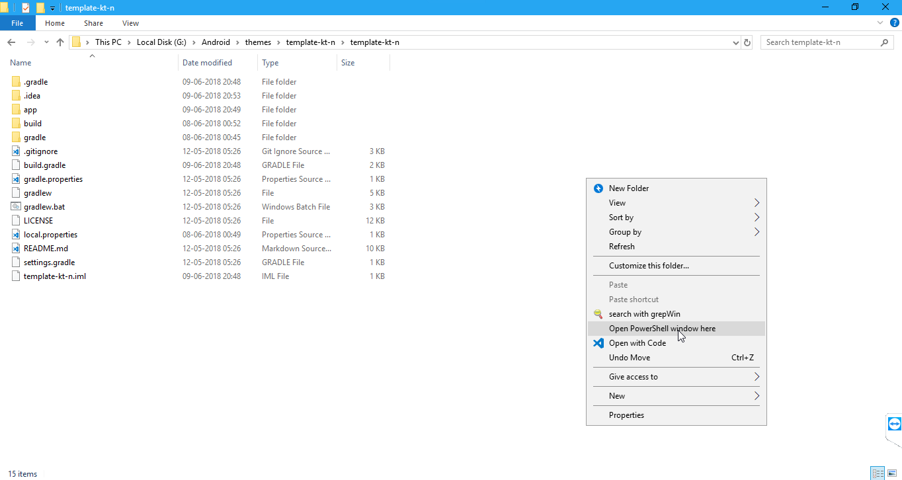

4. Type and enter `./gradlew assembleDebug`. Gradle wrapper will begin downloading dependencies and will setup everything automatically.

>Gradle is syncing dependencies required for the project.
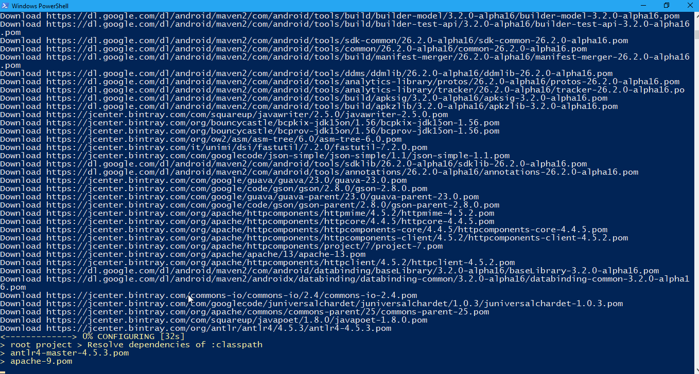

>Gradle is compiling the project after syncing successfully.
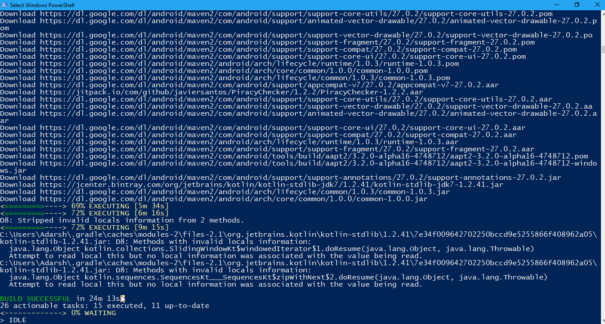

>Project is successfully compiled.
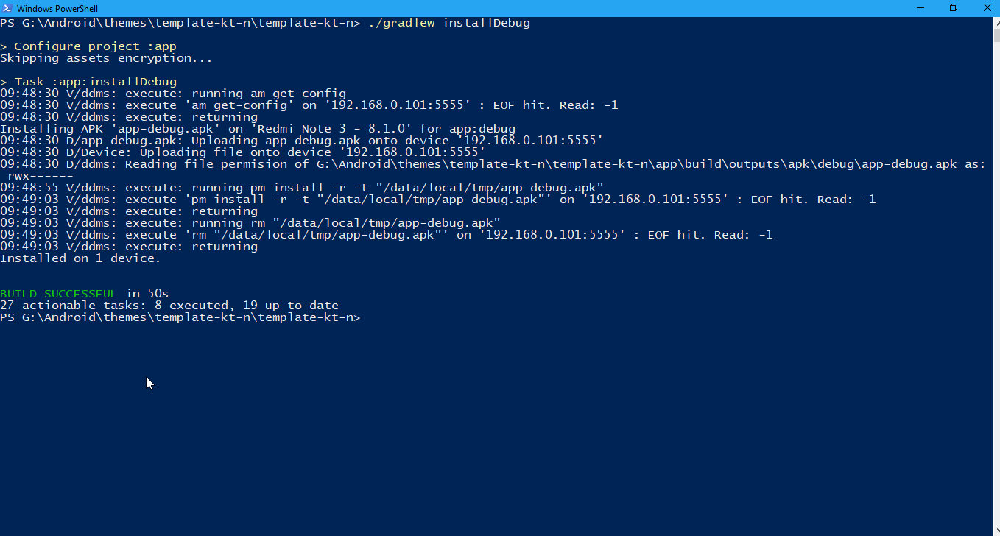

>To build and install app to the connected device, enter `./gradlew installDebug`.
