# Introduction to Substratum Type options

**List of available type options:**  
• [Type1 (Injection-based replacements)](substratum_types_information.md#type1-injection-based-replacements)  
• [Type2 (Resource-based extensions)](substratum_types_information.md#type2-resource-based-extensions)  
• [Type3 (Alternative resource base)](substratum_types_information.md#type3-alternative-resource-base)  
• [Type4 (Asset replacement)](substratum_types_information.md#type3-alternative-resource-base)  

## Type1 (Injection-based replacements)
**Usage:**  
To create optional extensions like accents and background colors.

**Abilities:**  
Type1(s) can overlay any files under target/res/values/.

**Limitations:**  
Only 3 type1(s) (type1a, typ1b, typ1c) can be added to a target.
Can overlay files under target/res/values only.

**Instructions:**  
Setting up type1(s) is the most basic step to get your theme up and running.
We usually use type1(s) for “android” (framework-res) target to create extensions/options like accents, background colors.


>Basic structure of type1(s).

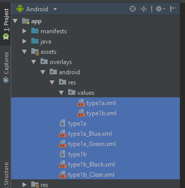

```
We're now creating the android overlay with Red as default and blue color as an optional accent,
Dark as default and black color as an optional background.
```

**Accent:**  
1. Create a file called type1a (without extensions) in the root of android/target directory. and inside of it write
   “Accent - Default” (Can be named anything).
2. Create a file called type1a.xml in assets/overlay/android/res/values/ and add default red color or any color you want
   to overlay by default (default
   resources without choosing an option)
3. Create a file called type1a_Blue.xml in assets/overlay/android/ (notice the structure, type1’s extension file(s) must
   be placed at parent directory of res/
   of target) and paste the same content of type1.xml, but replace the color hex value to blue.  

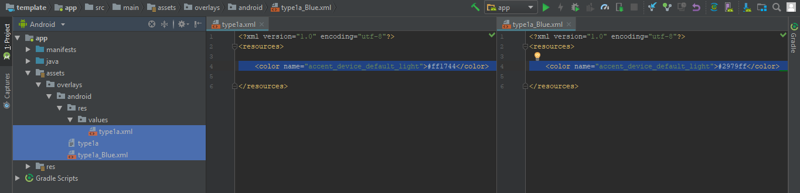


>We can add multiple type1a options.

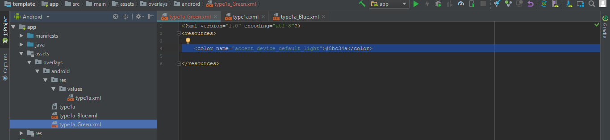

**Background:**  
1. Create a file called type1b (without extensions) in the root of the android directory. and inside of it write “Background –
   Default”.
2. Create a file called type1b.xml in assets/overlay/android/res/values/ and add default dark color or any color you want
   to overlay by default (default
   resources without choosing an option)

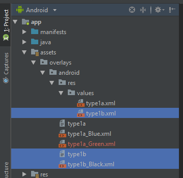


3. Create a file called type1b_Black.xml in assets/overlay/android/ (notice the directory structure, type1’s extension      file(s) must  be placed at parent      directory of res/ of target)  and paste same content which was in type1b.xml, but
   replace color hex value to black.

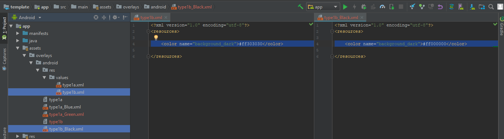


>We can add multiple type1b options. 

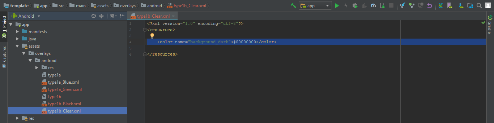


>After installing the compiled app, you'll see android target now has a drop-down option for choosing
accent and background!.

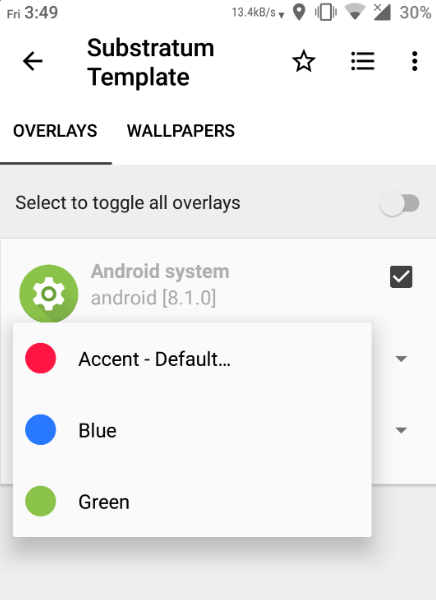

```
While applying theme by choosing Accents and Background, substratum will hotswap/replace
resources of target/res/values/type1*.xml with  target/type1*_varientname.xml.
```  


```  
Notes:  
• Step 2 in Accent/Background is optional, you can skip and remove default color, by doing so users
  must choose options from type1(s) before proceeding to apply.
• More accents/background variants can be added by creating a file like type1a_Accent/BackgroundName.xml.
• Substratum will get the first color from type1(a/b/c)_varientname.xml to show color preview, so make sure
  the first color in type1(a/b/c)_varientname.xml file has the color resource you wanted to be shown on 
  preview. also make sure it has hex and not referenced (@android:color/) to any other color.
```

## Type2 (Resource-based extensions)
While type1(s) are limited to only overlay files on target/res/values, type2 can overlay any files under target/res/. Which means its possible to theme any resources like values/*, layout/, drawables etc.
Type2 is usually used for providing multiple options by replacing same resources. for example navbar icons, which will basically replace the same drawable
file with different designs.

**Usage:**  
• To create the optional extension to replace resource files like drawables, layouts etc.

**Abilities:**  
• Type2 can overlay any files under target/res/.

**Limitations:**  
• Only 1 type2 per target.

>Basic structure of type2  


`Now we will be creating type2 options for choosing drawable tint.`

**instruction:**  
1. Create a file called type2 at the root of a target directory and write “Icons tint – Default”
2. Create a folder called type2_White/drawable/ and copy all icons from target/res/drawable/ but change its tint to white.

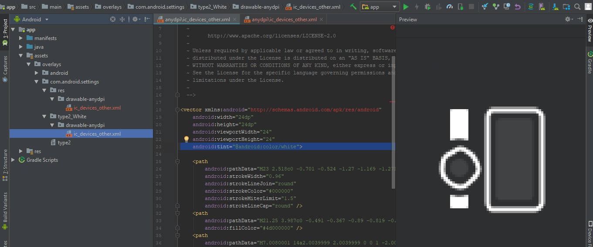

  
>We can add multiple sub-type2 options


>After installing the compiled app, you'll see target now have a drop-down option for choosing icon tint.

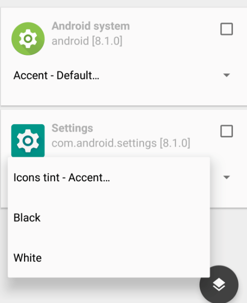


```
While applying theme by choosing type2_White, substratum will hotswap/replace
target/res/drawable/filename.xml with target/type2_White/drawable/filename.xml.
```

## Type3 (Alternative resource base)

**Usage:**  
• To create the optional base like light and dark theme.

**Ability:**  
• Type3’s can overlay any files under target/res/.
• Can add many type3's as possible
• Possibility to ship single theme with completely different base (ex: light and dark theme).

**Limitations:**  
While type1 and type2 are used as the extension. type3 is a complete alternative resource base.
By using type3, can ship two different kind of theme base like light and dark in one theme.

  
>Basic structure of type3  

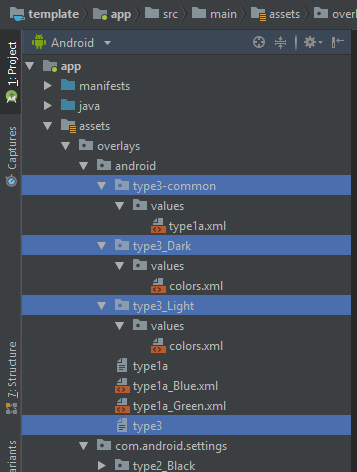


`Now we will be creating two type3 base for Light and Dark theme.`

**Instructions:**  
1. Create a file called type3 (without extensions) in the root of the android directory. and inside of it write “Select base      style”.
2. Create a directory called assets/overlay/android/type3_Light/ and add resources we need for a light base.
3. Create a directory called assets/overlay/android/type3_Dark/ and add resources we need for a dark base.

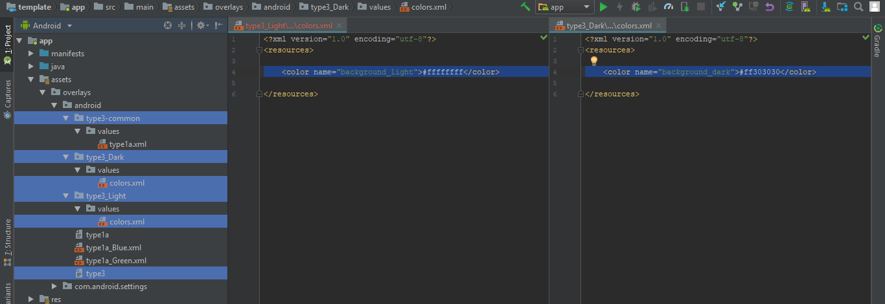


>We can add multiple type3’s  options like below structure.  

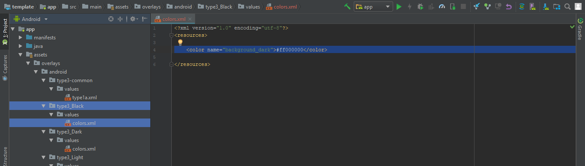


>Now after installing the compiled app, you'll see there is a top-level drop-down menu for selecting base style.

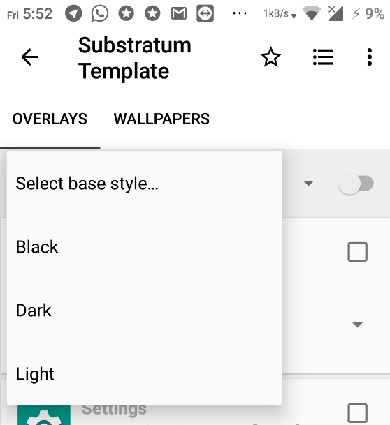

```
Notes:
• Very complicated compared to other type's
• Have to move every target resources to type3_varientname/ (in our case, type3_Light and type3_Dark)
  directories even if the target doesn't have light/dark dependent resources. this step can be more 
  simplified by just adding type3-common in targets (navbar, statusbar, qs tiles) which just has 
  drawables (instead of adding same drawables to type3_Light and type3_Dark).  
• If one of the targets has a missing type3 directory, substratum will fail to compile.
• Extra effort from themer point of view but very fast and easier experience for end user.
```

**About type3-common:**   
```
Type3-common is useful if you have multiple type3 variants. instead of adding same drawables and layouts
etc to all type3’s, you can move those to type3-common/ and have those files shared between all the type3’s.
```

```
While applying theme with chosen type3 base style, substratum will include resources from type3-common.
```

## Type4 (Asset replacement)  
Type4 is used very rarely for overlaying assets/ found in some apps.
With type4, emoji’s/fonts of target app can be themed.

**Usage:**  
• To replace assets of targets (ex: emojis or any files which are in assets/)

**Ability:**  
• Type4 can overlay any files under target/assets/.

**Limitations:**  
• Only 1 type4 per target

>Basic structure of type4.  


**instruction:**  
1. Create a file called type4 at the root of a target directory and write “Asset replacement”
2. Create a folder called type4_Custom/ and copy themed assets.

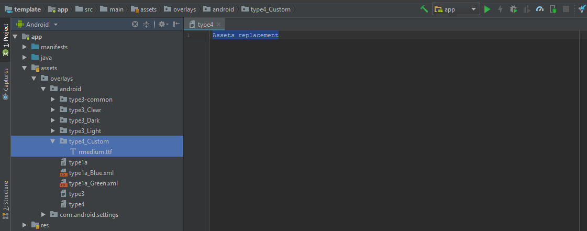

>We can add multiple sub-type4 options.

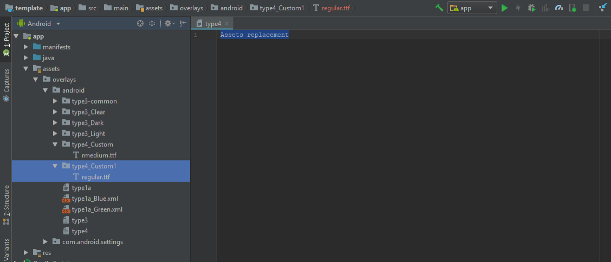


>Now after installing the compiled app, you'll see target now have a drop-down option for choosing
assets replacement.

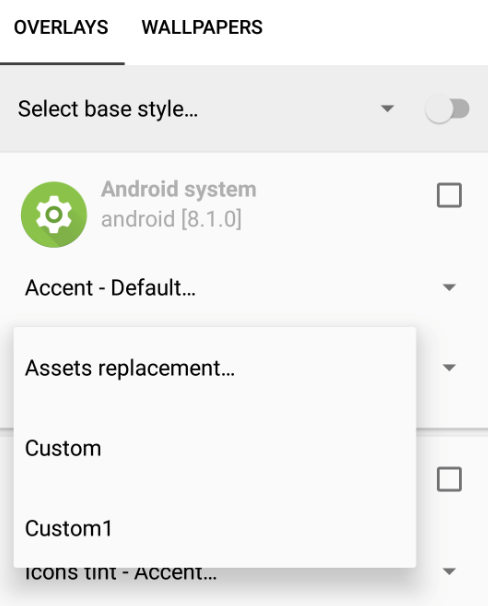

```
Note: Dont use " " spaces for type(s) filename, instead use "_" (underscore), substratum will
      replace "_" to space " " afterward.
```
